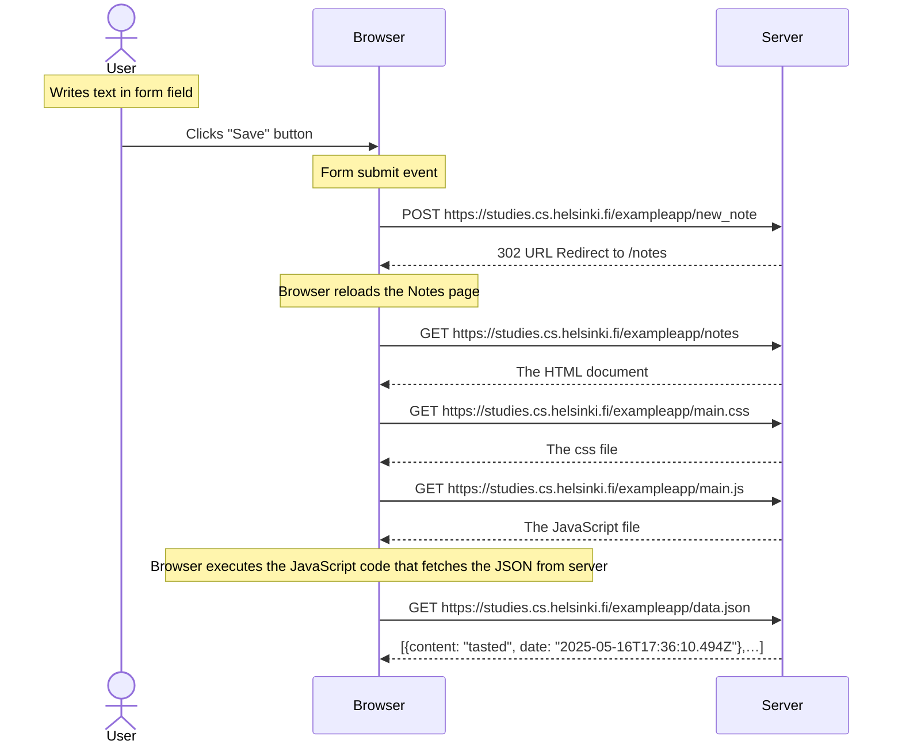

```mermaid
sequenceDiagram
    actor User
    participant Browser
    participant Server

    Note over User: Writes text in form field
    User->>Browser: Clicks "Save" button
    
    Note over Browser: Form submit event

    Browser->>Server: POST https://studies.cs.helsinki.fi/exampleapp/new_note
    Server -->> Browser: 302 URL Redirect to /notes

    Note over Browser: Browser reloads the Notes page

    Browser->>Server: GET https://studies.cs.helsinki.fi/exampleapp/notes
    Server-->>Browser: The HTML document

    Browser->>Server: GET https://studies.cs.helsinki.fi/exampleapp/main.css
    Server-->>Browser: The css file

    Browser->>Server: GET https://studies.cs.helsinki.fi/exampleapp/main.js
    Server-->>Browser: The JavaScript file

    Note over Browser: Browser executes the JavaScript code that fetches the JSON from server

    Browser->>Server: GET https://studies.cs.helsinki.fi/exampleapp/data.json
    Server-->>Browser: [{content: "tasted", date: "2025-05-16T17:36:10.494Z"},…]
```