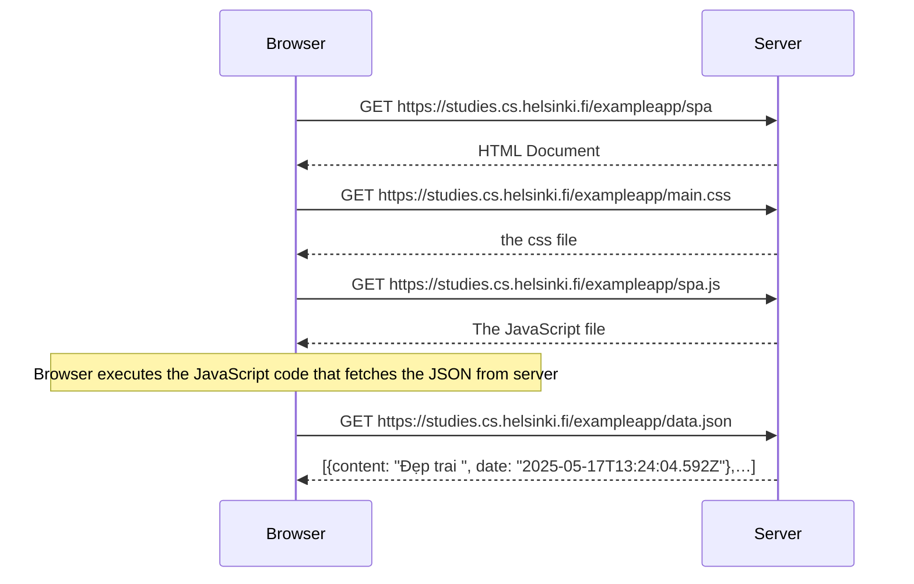

```mermaid
sequenceDiagram
    participant Browser
    participant Server

Browser->>Server: GET https://studies.cs.helsinki.fi/exampleapp/spa
Server-->>Browser: HTML Document

Browser->>Server: GET https://studies.cs.helsinki.fi/exampleapp/main.css
Server -->>Browser: the css file

Browser->>Server: GET https://studies.cs.helsinki.fi/exampleapp/spa.js
Server-->>Browser: The JavaScript file

    Note over Browser: Browser executes the JavaScript code that fetches the JSON from server

Browser->>Server: GET https://studies.cs.helsinki.fi/exampleapp/data.json
Server-->>Browser: [{content: "Đẹp trai ", date: "2025-05-17T13:24:04.592Z"},…]

```