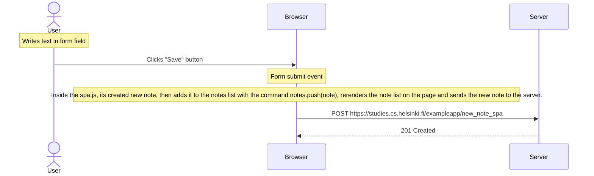

```mermaid
sequenceDiagram
    actor User
    participant Browser
    participant Server

    Note over User: Writes text in form field
    User->>Browser: Clicks "Save" button
    
    Note over Browser: Form submit event

        Note over Browser: Inside the spa.js, its created new note, then adds it to the notes list with the command notes.push(note), rerenders the note list on the page and sends the new note to the server.

    Browser->>Server: POST https://studies.cs.helsinki.fi/exampleapp/new_note_spa

    Server -->> Browser: 201 Created
```